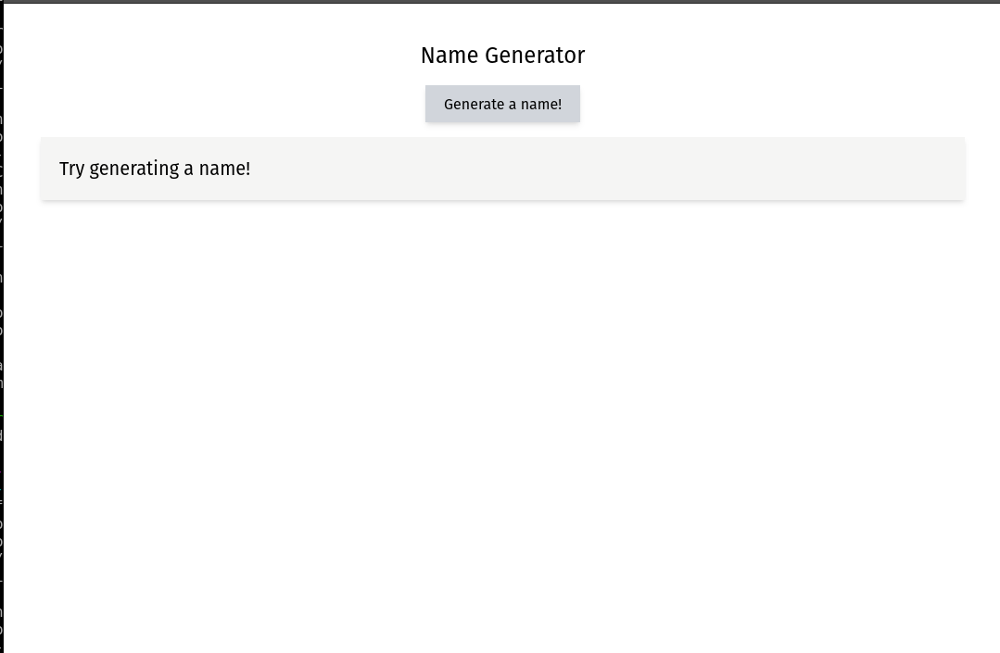

## Rust & React GPT-3 usage example

### Introduction
This repo is intended to show an example of how you can write a full-stack web app that uses GPT-3 to create meaningful data based on an input.

### Preview

### Built With
This project was built using React, Typescript and Rust (with the Axum framework).